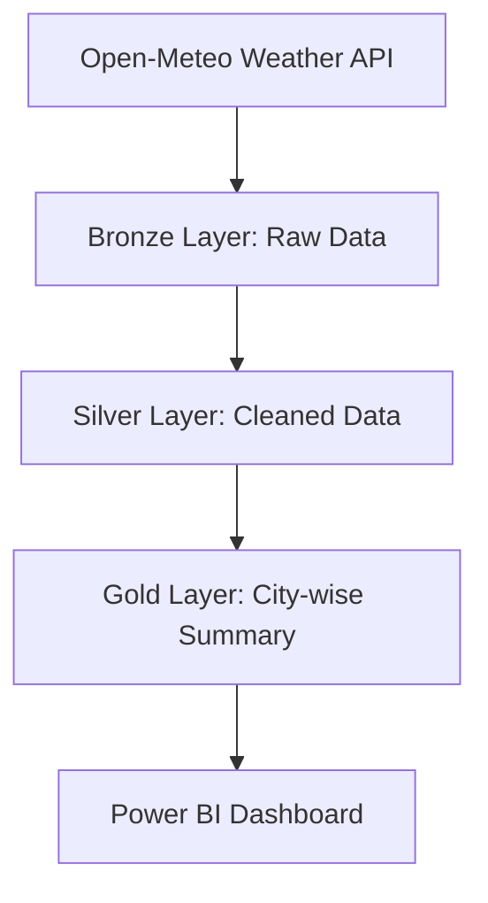

# Weather Data Pipeline Architecture

```mermaid
flowchart TD
    A["Open-Meteo Weather API"] --> B["Bronze Layer: Raw Data"]
    B --> C["Silver Layer: Cleaned Data"]
    C --> D["Gold Layer: City-wise Summary"]
    D --> E["Power BI Dashboard"]
```
